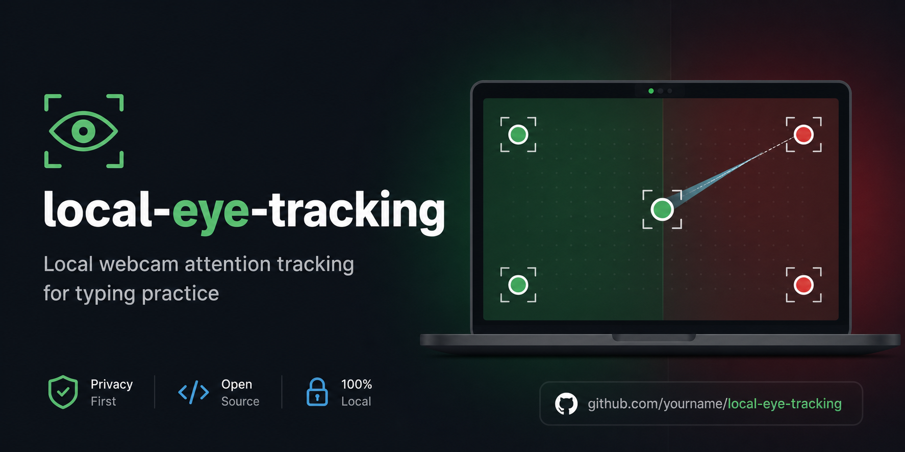

# Local Eye Tracking

Local-only webcam attention tracking for typing practice.

**Live demo:** [https://local-eye-tracking.vercel.app](https://local-eye-tracking.vercel.app)

**Privacy promise:** webcam frames stay in your browser. This app does not upload video, images, recordings, calibration data, or evaluation exports.

Local Eye Tracking is an experimental browser app that uses a laptop webcam to estimate whether a typing student appears to be looking at the screen or looking down/away. It uses local MediaPipe Face Landmarker features, a calibration-aware binary classifier, smoothing, diagnostics, and a local evaluation workflow.

The goal is not exact gaze-coordinate prediction. The goal is lightweight binary feedback: green when the user appears to be looking at the screen, red when the user appears to be looking away, looking down at the keyboard, or missing from the webcam frame long enough to matter.

## Current Status

This project is an experimental prototype for local testing and tuning. It is not a medical device, accessibility system, proctoring product, or production-grade biometric system.

Accuracy depends on webcam placement, lighting, face framing, posture, glasses, and calibration quality. Treat results as a signal to tune and evaluate, not as ground truth.

## What It Does

- Requests webcam access in the browser.
- Loads local MediaPipe Face Landmarker model and WASM assets.
- Guides a six-step calibration: five screen points plus a keyboard-looking sample.
- Rejects weak keyboard calibration and asks for a retry.
- Runs a full-screen green/red attention test.
- Uses keyboard-looking and side-gaze diagnostics.
- Smooths raw classifier output to reduce flicker.
- Provides a local evaluation panel for labeled samples.
- Exports local JSON evaluation files.
- Includes a CLI analyzer for evaluation exports.

## Privacy Model

The app is designed to run locally.

- No accounts, backend, or server-side storage are required.
- Webcam processing happens in the browser.
- MediaPipe model and WASM assets are served from this repository's `public/` directory.
- The app does not upload video frames, images, or webcam recordings.
- Calibration data is held in memory for the current browser session.
- Evaluation exports are user-triggered JSON files containing numeric feature samples and classifier output, not video.

## Architecture

The app is built with React, TypeScript, and Vite. Webcam tracking uses `@mediapipe/tasks-vision` with local model and WASM assets.

```text
webcam frame
  -> MediaPipe Face Landmarker
  -> feature extraction
  -> calibration-aware classifier
  -> smoothing
  -> green/red UI
```

Important modules:

- `src/hooks/useCamera.ts`: webcam permission and stream state.
- `src/hooks/useAttentionLoop.ts`: browser frame loop for tracking.
- `src/tracking/faceTracker.ts`: MediaPipe Face Landmarker setup and detection wrapper.
- `src/domain/landmarks.ts`: converts landmarks and model outputs into frame features.
- `src/domain/calibration.ts`: creates calibration profiles and keyboard separation quality.
- `src/domain/classifier.ts`: classifies each frame as `looking`, `unknown`, `away`, or `face-missing`.
- `src/domain/smoothing.ts`: turns raw classifier states into stable green/red display state.
- `src/domain/statePipeline.ts`: connects classifier output to smoothing.
- `src/domain/evaluation.ts`: local labeled evaluation sample model and summaries.
- `scripts/analyze-evaluation.mjs`: CLI analyzer for exported evaluation JSON.

## How Tracking Works

The tracker extracts a compact feature vector from each valid webcam frame. Features include head-pose estimates, aggregate eye movement, per-eye horizontal and vertical signals, eye openness, face center, and face scale.

Calibration builds a screen-looking profile from five guided screen points:

1. Top left
2. Top right
3. Bottom right
4. Bottom left
5. Center

Calibration then captures a keyboard-looking sample. The app computes keyboard separation quality from the screen profile and keyboard profile. If that separation is weak, the app retries the keyboard calibration step instead of entering test mode.

During testing, the classifier combines:

- Screen-profile distance.
- Keyboard projection score.
- Keyboard calibration quality.
- Side-gaze score.
- Face presence.

It emits one raw state per frame:

- `looking`
- `unknown`
- `away`
- `face-missing`

The smoother then applies forgiving timing so brief blinks, transient uncertainty, and short interruptions do not immediately flip the UI red.

## Getting Started

Install dependencies:

```bash
npm install
```

Start the local dev server:

```bash
npm run dev
```

Open:

```text
http://127.0.0.1:5173/
```

Camera access generally requires `localhost` or `127.0.0.1` in a modern browser.

## Using The App

1. Open `http://127.0.0.1:5173/`.
2. Allow camera access.
3. Wait for camera, tracker, and face readiness.
4. Click **Start calibration**.
5. Look at each screen dot during the countdown.
6. Look down at the keyboard during the keyboard calibration step.
7. If keyboard calibration is weak, retry while looking down and keeping your face visible.
8. Use the full-screen test.
9. Recalibrate when lighting, posture, camera placement, or the user changes.

In test mode:

- Green means the user appears to be looking at the screen.
- Red means the user appears to be looking away, looking down, or missing from the webcam frame after smoothing.

## Evaluation Workflow

The app includes a local evaluation panel during test mode. It captures labeled feature/classifier samples for tuning. It does not capture video frames.

The balanced baseline target is 20 samples per label:

- `screen-center`
- `screen-bottom`
- `keyboard`
- `off-left`
- `off-right`
- `lean-left`
- `lean-right`
- `low-light`

That produces a balanced `160/160` sample export.

After exporting JSON from the evaluation panel, analyze it with:

```bash
npm run analyze:evaluation -- /path/to/eyes-baseline-eval.json
```

Key analyzer fields:

- `False-looking rate`: away-role samples classified as looking. This is the critical metric for keyboard and offscreen detection.
- `False-away rate`: screen-role samples classified as away. This catches over-aggressive red states.
- `Median keyboard`: keyboard projection score by label.
- `Median side`: side-gaze score by label.
- `Face missing`: webcam framing or landmark tracking loss.

## Development Commands

```bash
npm run dev
npm test
npm run build
npm run analyze:evaluation -- <export.json>
```

The test suite covers domain logic, hooks, components, calibration behavior, classifier behavior, smoothing, evaluation summaries, and the evaluation analyzer.

## Repository Layout

```text
src/components/        React UI screens and panels
src/domain/            Calibration, features, classifier, smoothing, evaluation logic
src/hooks/             Camera and frame-loop hooks
src/tracking/          MediaPipe Face Landmarker wrapper
scripts/               Evaluation export analyzer
public/models/         Local MediaPipe model asset
public/wasm/           Local MediaPipe WASM runtime assets
docs/superpowers/      Design specs and implementation plans
```

## Limitations

- Webcam gaze detection is approximate.
- This is binary attention feedback, not exact gaze-coordinate prediction.
- Lighting, camera angle, face position, glasses, and posture can affect results.
- Keyboard calibration quality is critical.
- Leaning out of frame causes `face-missing` states.
- Calibration profiles are not saved between sessions.
- The app has no accounts, teacher dashboard, storage backend, or typing lesson integration.

## Roadmap

- Improve calibration quality feedback.
- Improve lean and face-framing handling.
- Add richer evaluation reports.
- Compare future model-based gaze estimators only if the current MediaPipe pipeline cannot meet the binary attention metric.
- Consider a student typing-session summary after classifier accuracy is stable.

## License

[MIT License](LICENSE). Copyright (c) 2026 PSkinnerTech.
